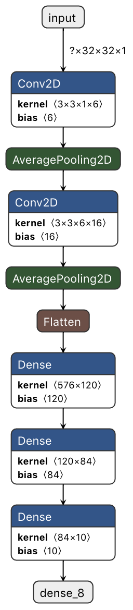
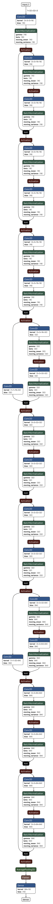
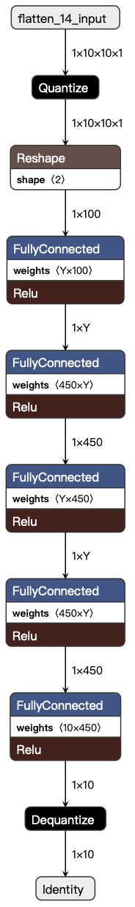
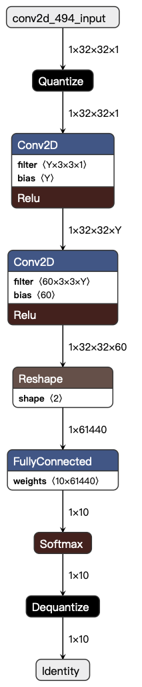
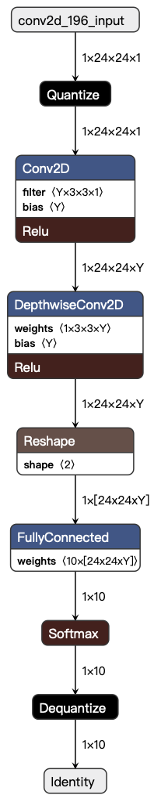

# Measuring what Really Matters: Optimizing Neural Networks for TinyML - Models

This repository contains multiple Jupyter notebooks which were used for the implementation part of the paper *Measuring what Really Matters: Optimizing Neural Networks for TinyML*.
This repository contains the trained models which were evaluated and deployed on microcontrollers:

- LeNet5 on MNIST
- ResNet-20 on CIFAR-10
- Dense layers benchmarking
- Convolutional layers benchmarking
- Depth-wise convolutional layers benchmarking

The models were trained and saved as a Keras file by using TensorFlow.

For the conversion process to `.tflite` see the [toolchain repository](../TFLM-toolchain).

## LeNet

## ResNet

## Dense layers benchmarking

## Convolutional layers benchmarking

## Depth-wise convolutional layers benchmarking

